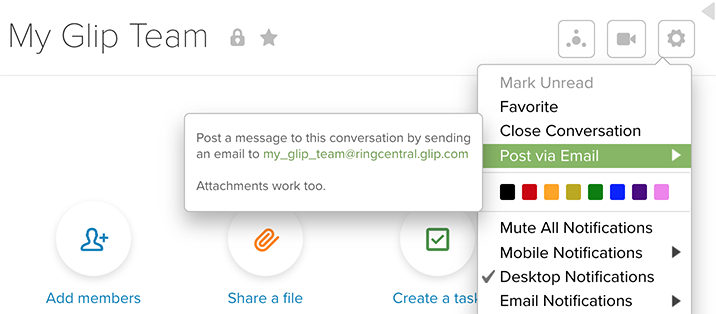
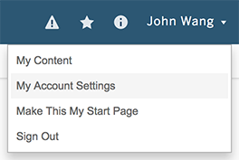
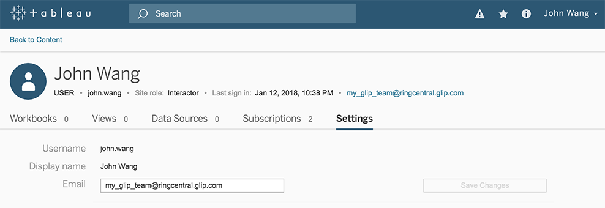
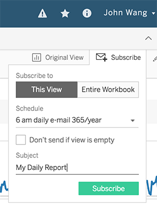
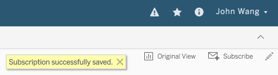

# Tableau-Glip Email Subscription

[ [email](../email-integrations.md) ]

You can use Glip's team email to automatically send notifications to your Glip team. You will receive Glip posts with images of dashboards and links to Tableau.

To do this you will need to set your Tableau user email to the Glip team email where you want to send the notifications. 

To do this, use the following instructions:

1) Get the email for your Glip Team by clicking your team's Settings icon and then `Post via Email`

2) Go to `My Account Settings` to chage your email address.

3) Set your `Email` to your Glip team email and then click `Save Changes`.

4) Go to the Tableau workbook view you want to get a subscription for, then click `Subscribe`. Select `This View` or `Entire Workbook` and then click `Subscribe`

When the subscription has been created you will see the `Subscription successfully saved.` message.

