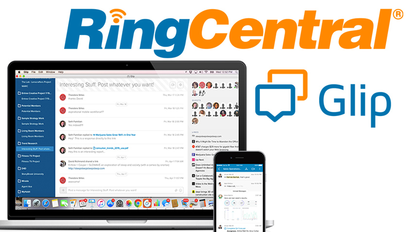

# Glip Integration Guide

This guide covers the major ways to create integrations with Glip from out-of-the-box integrations to custom development via APIs listed below.

* [Pre-Built Integrations](pre-built-integrations.md)
* Zapier
* [Email](email-integrations.md)
* [Inbound Webhooks](webhook-integrations.md)
* Outbound Webhooks and Subscription API
* Bot Users
* REST API

Anyone can use pre-built integrations, Zapier and email, while some development abilities are necessary for the rest.

Read on for how to use these capabilities and a list of integration notes.

Integrations notes are available for the following apps:

* [Tableau](tableau.md)